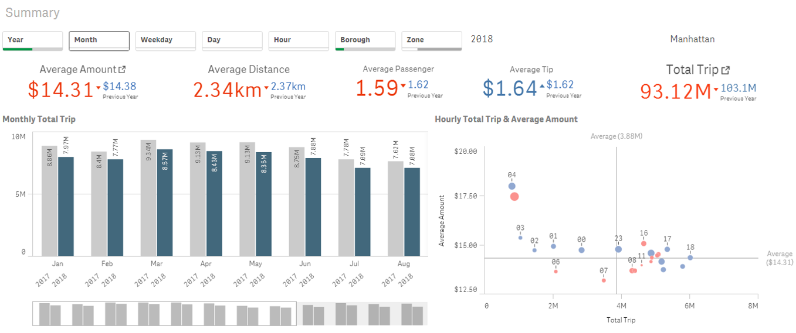
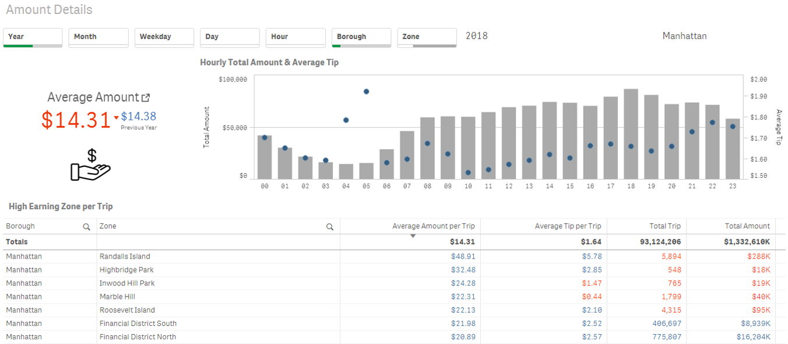
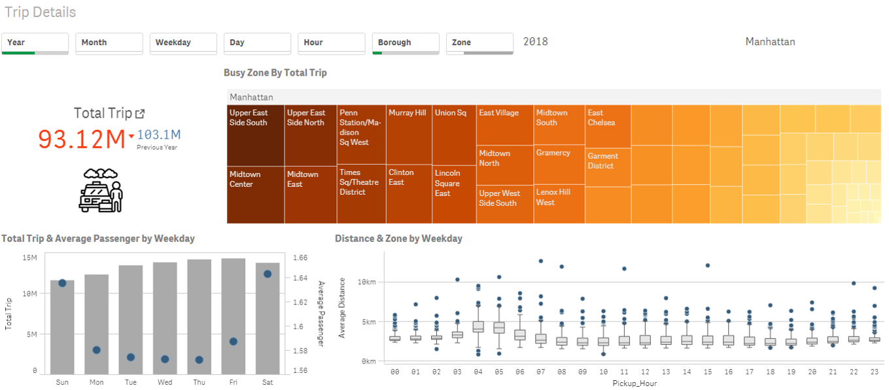
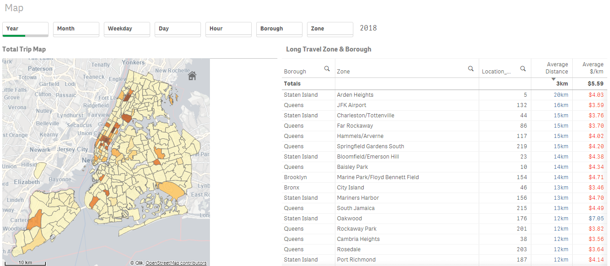
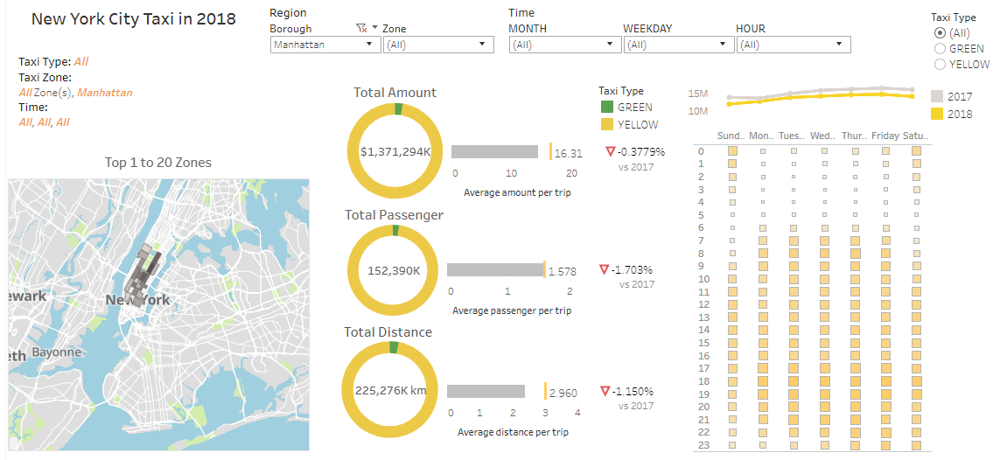

## NYC Taxi Data Visualization Using Qlik Sense & Tableau
- Author: Sekyung Na
- Link to my tableau Workbook: https://public.tableau.com/profile/sekyung.na6348#!/vizhome/NYCTaxi20183/Summary
- LinkedIn: https://www.linkedin.com/in/sekyung-na-95500a5a/

  I would love to hear any opinion about my analysis! Please message me via LinkedIn if you have any questions.

### Summary 
The goals to create Tableau dashboard is to help people understand about key statistics and insights about daily trips of taxis in New York. The questions which my Qlik Sense & Tableau dashboard tried to answer are as follows.

1)	Understand the current status by basic statistics
2)	Determine busy hours and places 

### Dataset Description
The dataset, “TLC Trip Record Data” is from the NYC Taxi & Limousine Commission that contains the data below.

-	Pick-up dates/times
-	Pick-up locations
-	Trip distances
-	Itemized fares
-	Rate types
-	Payment types
-	Driver-reported passenger counts

Details of the dataset can be found in the website below.
-	Yellow cab: https://www1.nyc.gov/assets/tlc/downloads/pdf/data_dictionary_trip_records_yellow.pdf
-	Green cab: https://www1.nyc.gov/assets/tlc/downloads/pdf/data_dictionary_trip_records_green.pdf

The period of the dataset I used is from 2017-2018 and there are 2 types of taxis, yellow (medallion) cab, green (“boro”) cab. FHV data ex excluded as it may not represent the total amount of trips dispatched by all TLC-licensed bases as the site said it is hard to guarantee or confirm its accuracy or completeness. The data can be found in the website below.

URL: https://www1.nyc.gov/site/tlc/about/tlc-trip-record-data.page

### Data Planned to Use
Because every single monthly data has millions of rows, I thought better to have some calculations grouped the data by Timestamp to hour and location data. To do this, I picked up which data is needed to be shown on Dashboards as follows.

-	SUM(Total_amount) : Show total fares
-	AVG(Total_amount): Show average fares - for average validation later
-	SUM(Trip_distance): Show total trip distance
-	AVG(Trip_distance): Show the average trip distance - for average validation later
-	SUM(Passenger_count): Show total passenger count
-	AVG(Passenger_count): Show the average passenger count - for average validation later
-	SUM(Fare_amount): The time-and-distance fare calculated by the meter
-	SUM(Extra): Miscellaneous extras & surcharges
-	SUM(Tip_amount): automatically populated for credit card tips. Cash tips are not included
-	SUM(Tolls_amount): Total amount of all tolls paid in trip  
-	COUNT(VendorID): Just in case when calculating the right average is needed

This is groupbed by Hour, PULocationID

### Calculation by Using Pyspark 
Since it has over millions rows in a file, calculation by Python was very slow. Therefore, I used Pyspark for calculation so that it will speed up the calculation.
The python script for this is attached with the name, "PysparkCalculation.py".

### Extract Latitude & Longitude from the Location CSV File 
At first, I used Geocode for extracting latitude & longitude data from the zone.csv.
Script attached: GeoCodingTaxi.py

However, some cities returned wrong latitude & longitude information due to the error caused by city name (City separated with south & north etc). I thought it is hard to find longitude & latitude, so decided to download & use shape file for Tableau and KMZ file for Qlik Sense to create a map on the dashboard. You can download it on the website below.

URL: https://geo.nyu.edu/catalog/nyu-2451-36743

### Qlik Sense Dashboard
- Summary

- Amount Details

- Trip Details

- Map Details

### Tableau Dashboard
- Summary

Link: https://public.tableau.com/profile/sekyung.na6348#!/vizhome/NYCTaxi20183/Summary

### Challenge Remained
I realized that even though I can determine where 
